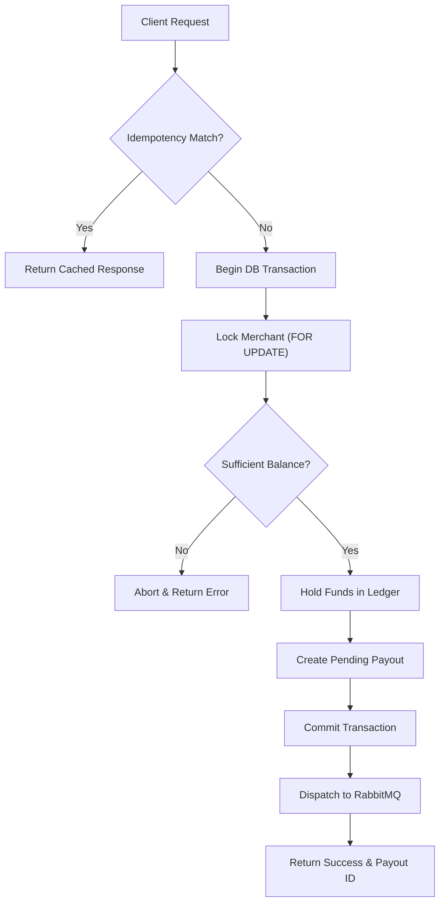
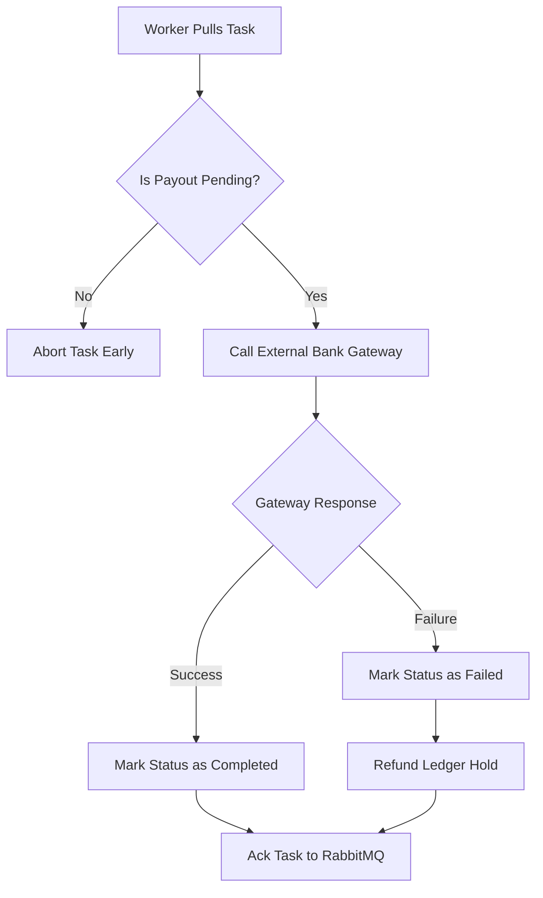

# Backend Technical Explainer (playto_be_core)

This document answers specific architectural questions regarding the money-moving logic in the backend.

## 1. The Ledger
**Balance Calculation Query:**
```sql
SELECT
    COALESCE(SUM(CASE WHEN type = 'credit' AND status = 'completed' THEN amount_paise ELSE 0 END), 0) -
    COALESCE(SUM(CASE WHEN type = 'debit' THEN amount_paise ELSE 0 END), 0) as balance
FROM api_ledger
WHERE merchant_id = %s
```
**Why this model?**
We use an append-only ledger. Credits are only counted when `completed`, but **all debits count immediately** (even `pending` holds). This ensures that once a payout is requested, the funds are "reserved" and cannot be double-spent while the async worker is processing the payment. If a payment fails, we write a *new* credit entry to reverse the hold, maintaining a perfect audit trail.

## 2. The Lock
**The Guard Code:**
```python
# In playto_be_core/api/v1/services/payout_service.py
lock_query = "SELECT id FROM api_merchant WHERE id = %s"
if connection.features.has_select_for_update:
    lock_query += " FOR UPDATE"
cursor.execute(lock_query, [merchant.id])

balance = LedgerService.get_balance(merchant.id)
if balance < amount_paise:
    raise ValueError("Insufficient balance")
```
**Database Primitive:**
This relies on **PostgreSQL Row-Level Locking (`SELECT FOR UPDATE`)**. It serializes concurrent requests for the *same merchant* at the database level. The second request will wait until the first transaction commits its ledger hold, ensuring the second balance check sees the reduced amount.

## 3. The Idempotency
**How it works:**
We use a unique constraint on `(merchant_id, idempotency_key)` in the `api_idempotency` table.
**Collision Handling:**
If a second request arrives while the first is in-flight:
1. The second request attempts to create an idempotency record.
2. It hits the `UniqueConstraint` and waits (Postgres transaction queuing).
3. Once the first transaction commits, the second one wakes up, sees the existing record, and returns the cached `response_json` without ever triggering the payout logic.

## 4. The State Machine
**Terminal State Protection:**
```python
# In playto_be_core/api/tasks.py
with connection.cursor() as cursor:
    cursor.execute("SELECT status FROM api_payout WHERE id = %s", [payout_id])
    row = cursor.fetchone()
    if row and row[0] in ('completed', 'failed'):
        return f"Payout {payout_id} already {row[0]}"
```
This check prevents a worker from processing a payout that has already reached a terminal state (e.g., trying to "complete" a payout that was already marked "failed").

## 5. The AI Audit
**Subtly Wrong AI Code:**
AI initially suggested checking idempotency *before* starting the payout transaction:
```python
# WRONG: Check-then-act race condition
row = cursor.execute("SELECT ... FROM api_idempotency WHERE key = %s")
if row: return row.response
# ... start transaction ...
```
**The Catch:** Two requests could both miss the check simultaneously, both start transactions, and both create duplicate payouts. 
**The Fix:** I replaced it with an atomic `INSERT` or `SELECT FOR UPDATE` on the idempotency table *inside* the transaction, leveraging the database's unique constraint as a distributed lock.

## 6. The Message Broker (RabbitMQ)
**Why RabbitMQ?**
We use **RabbitMQ** to ensure reliable task queuing. RabbitMQ uses the AMQP protocol with active heartbeats, ensuring that the connection between the API and the Worker remains stable even during long periods of inactivity.

**Robustness Configuration:**
1. **CELERY_TASK_ACKS_LATE**: Tasks are only removed from the queue *after* they are successfully processed. If a worker crashes, the task is automatically re-queued.
2. **CELERY_WORKER_PREFETCH_MULTIPLIER = 1**: Prevents one worker from "hogging" multiple tasks. This ensures fair distribution and visibility into the queue.
3. **rpc:// Result Backend**: Uses transient queues for task results, which is highly efficient for RabbitMQ for one-off results.

## 7. Request to Response Flow (API)
**Step-by-Step Execution:**
1. **Client Request**: The client sends a payout request to the API with an idempotency key.
2. **Idempotency Check**: The system validates against `api_idempotency`. If a match is found, the cached response is returned immediately.
3. **Pessimistic Locking**: A transaction begins, locking the merchant's record (`SELECT FOR UPDATE`) to prevent race conditions.
4. **Balance Check & Ledger Hold**: The balance is verified. A `pending` debit is written to the ledger to reserve the funds.
5. **Record Creation**: The payout record is created in a `pending` state, and the database transaction commits.
6. **Task Enqueueing**: The job is dispatched to the RabbitMQ broker queue.
7. **Client Response**: The API immediately responds with a successful acknowledgment and the `payout_id`.



## 8. Worker Task Execution Flow
**Step-by-Step Execution:**
1. **Task Retrieval**: The worker pulls the pending task from the RabbitMQ queue.
2. **Terminal State Check**: The worker checks the database to ensure the payout is still `pending`. If it's already `completed` or `failed`, it aborts early.
3. **External Gateway Execution**: The worker initiates the money transfer via the external banking provider API.
4. **Resolution Handling**:
   - **On Success**: Updates the payout status to `completed`.
   - **On Failure**: Updates the payout status to `failed` and writes a compensating `credit` to the ledger to release the held funds.
5. **Task Acknowledgment**: The worker sends an ACK to RabbitMQ, permanently removing the message from the queue.


