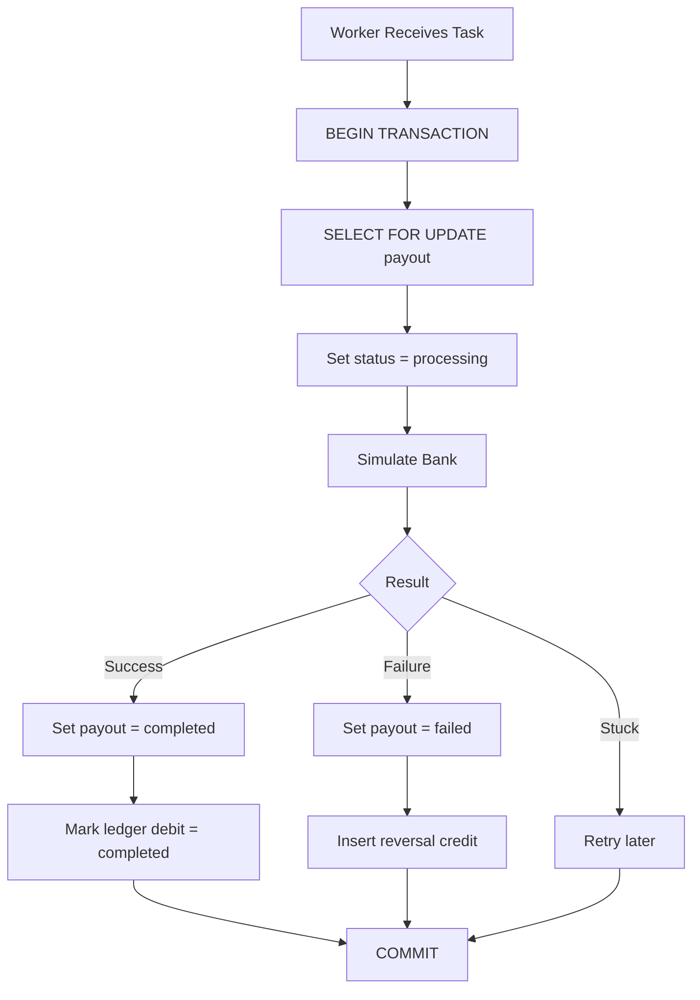

# Backend Technical Explainer (playto_be_core)

This document answers specific architectural questions regarding the money-moving logic in the backend.

## 1. The Ledger
**Balance Calculation Query:**
```sql
SELECT
    COALESCE(SUM(CASE WHEN type = 'credit' AND status = 'completed' THEN amount_paise ELSE 0 END), 0) -
    COALESCE(SUM(CASE WHEN type = 'debit' THEN amount_paise ELSE 0 END), 0) as balance
FROM api_ledger
WHERE merchant_id = %s
```
**Why this model?**
We use an append-only ledger. Credits are only counted when `completed`, but **all debits count immediately** (even `pending` holds). This ensures that once a payout is requested, the funds are "reserved" and cannot be double-spent while the async worker is processing the payment. If a payment fails, we write a *new* credit entry to reverse the hold, maintaining a perfect audit trail.

## 2. The Lock
**The Guard Code:**
```python
# In playto_be_core/api/v1/services/payout_service.py
lock_query = "SELECT id FROM api_merchant WHERE id = %s"
if connection.features.has_select_for_update:
    lock_query += " FOR UPDATE"
cursor.execute(lock_query, [merchant.id])

balance = LedgerService.get_balance(merchant.id)
if balance < amount_paise:
    raise ValueError("Insufficient balance")
```
**Database Primitive:**
This relies on **PostgreSQL Row-Level Locking (`SELECT FOR UPDATE`)**. It serializes concurrent requests for the *same merchant* at the database level. The second request will wait until the first transaction commits its ledger hold, ensuring the second balance check sees the reduced amount.

## 3. The Idempotency
**How it works:**
We use a unique constraint on `(merchant_id, idempotency_key)` in the `api_idempotency` table.
**Collision Handling:**
If a second request arrives while the first is in-flight:
1. **The Merchant Lock**: Both requests attempt to `SELECT ... FOR UPDATE` on the Merchant row. Postgres serializes them.
2. **The Winner**: The first request proceeds, checks balance, creates the payout, and commits the idempotency key.
3. **The Second Request**: Once the first commits, the second request wakes up. It immediately tries to insert the same `merchant_id + key` into `api_idempotency`.
4. **The Protection**: It hits the **Unique Database Constraint**. My code catches the `IntegrityError` and returns the first request's response instead of creating a second payout.

## 4. The State Machine
**Terminal State Protection:**
In `api/tasks.py`, before a worker starts processing, it locks the payout row and checks the state:
```python
# SELECT FOR UPDATE payout row
merchant_id, amount_paise, current_status, attempts = row
if current_status != 'pending':
    return f"Payout {payout_id} already {current_status}"
```
This check (running inside a transaction) ensures that a payout in `completed` or `failed` state can **never** be reset to `processing`. The `SELECT FOR UPDATE` prevents a race condition where two workers might try to process the same "stuck" task.

## 5. The AI Audit
**Subtly Wrong AI Code:**
AI initially suggested checking idempotency *before* starting the payout transaction:
```python
# WRONG: Check-then-act race condition
row = cursor.execute("SELECT ... FROM api_idempotency WHERE key = %s")
if row: return row.response
# ... start transaction ...
```
**The Catch:** Two requests could both miss the check simultaneously, both start transactions, and both create duplicate payouts. 
**The Fix:** I replaced it with a **Merchant-level lock** and a **Database Unique Constraint**. The system doesn't "check" if it exists; it tries to `INSERT` and relies on the database to raise an `IntegrityError` if it's a duplicate. This turns a race condition into a deterministic database error.

## 6. The Message Broker (RabbitMQ)
**Why RabbitMQ?**
We use **RabbitMQ** to ensure reliable task queuing. RabbitMQ uses the AMQP protocol with active heartbeats, ensuring that the connection between the API and the Worker remains stable even during long periods of inactivity.

**Robustness Configuration:**
1. **CELERY_TASK_ACKS_LATE**: Tasks are only removed from the queue *after* they are successfully processed. If a worker crashes, the task is automatically re-queued.
2. **CELERY_WORKER_PREFETCH_MULTIPLIER = 1**: Prevents one worker from "hogging" multiple tasks. This ensures fair distribution and visibility into the queue.
3. **rpc:// Result Backend**: Uses transient queues for task results, which is highly efficient for RabbitMQ for one-off results.

## 7. Request to Response Flow (API)
**Step-by-Step Execution:**
1. **Client Request**: The client sends a payout request to the API with an idempotency key.
2. **Idempotency Check**: The system validates against `api_idempotency`. If a match is found, the cached response is returned immediately.
3. **Pessimistic Locking**: A transaction begins, locking the merchant's record (`SELECT FOR UPDATE`) to prevent race conditions.
4. **Balance Check & Ledger Hold**: The balance is verified. A `pending` debit is written to the ledger to reserve the funds.
5. **Record Creation**: The payout record is created in a `pending` state, and the database transaction commits.
6. **Task Enqueueing**: The job is dispatched to the RabbitMQ broker queue.
7. **Client Response**: The API immediately responds with a successful acknowledgment and the `payout_id`.

```mermaid
graph TD
    A[POST /payouts] --> B1[Lookup Redis Cache]
    B1 --> B2{Found in Cache?}
    B2 -->|Yes| C[Return cached response]
    B2 -->|No| B3[Lookup DB Idempotency]
    B3 --> C2{Found & not expired?}
    C2 -->|Yes| D[Populate Cache + Return]
    C2 -->|No| E[BEGIN TX]
    E --> F[Lock merchant (SELECT FOR UPDATE)]
    F --> G[Check balance]
    G --> H{Sufficient?}
    H -->|No| I[Rollback + 400]
    H -->|Yes| J[Create payout (pending)]
    J --> K[Insert ledger debit (HOLD)]
    K --> L[Save DB Idempotency row]
    L --> M[COMMIT]
    M --> M1[Save to Redis Cache]
    M1 --> N[Enqueue task]
    N --> O[Return 201]
```

## 8. Worker Task Execution Flow
**Step-by-Step Execution:**
1. **Task Retrieval**: The worker pulls the pending task from the RabbitMQ queue.
2. **Terminal State Check**: The worker checks the database to ensure the payout is still `pending`. If it's already `completed` or `failed`, it aborts early.
3. **External Gateway Execution**: The worker initiates the money transfer via the external banking provider API.
4. **Resolution Handling**:
   - **On Success**: Updates the payout status to `completed`.
   - **On Failure**: Updates the payout status to `failed` and writes a compensating `credit` to the ledger to release the held funds.
5. **Task Acknowledgment**: The worker sends an ACK to RabbitMQ, permanently removing the message from the queue.



## 9. Redis In-Memory Caching
**Why Redis?**
To achieve high throughput (hundreds of requests per second), we cannot rely solely on PostgreSQL for idempotency lookups. Every DB query adds significant latency (especially in cloud environments).

**Implementation:**
1. **Cache-Aside Pattern**: The API first checks Redis for the idempotency key (`idempotency:{merchant_id}:{key}`).
2. **Speed**: Redis lookups take **<1ms**, compared to **50ms-200ms** for a remote DB query.
3. **Persistence**: We still write to the `api_idempotency` table as a safety net. If Redis is cleared or restarted, the system gracefully falls back to the database and re-populates the cache.
4. **TTL**: Cache entries are set with a **24-hour expiration**, matching the legal lifecycle of the idempotency keys.

## 10. The Retry Strategy
**Constraint:** Payouts stuck in `processing` for >30s should be retried with exponential backoff (max 3 attempts).

**How we solve it:**
1. **Reconciliation Task**: A Celery Beat task runs every minute. It identifies any payout that has been in the `processing` state for more than 30 seconds (based on `updated_at`).
2. **Safe Re-queueing**: The task resets these "stuck" payouts back to `pending` and re-enqueues them.
3. **Attempt Tracking**: The `payout.attempts` column is incremented every time a worker moves a payout to `processing`. 
4. **Hard Stop**: If `attempts >= 3`, the worker ignores the banking logic and immediately moves the payout to `failed`, triggering the atomic ledger refund.
5. **Backoff**: If the worker itself detects a "stuck" state during execution, it uses `self.retry(countdown=30 * (2 ** retries))` to perform an exponential backoff.

## 11. Docker Orchestration (Bonus)
**Goal:** Consistent environments and easy local testing.

**Implementation:**
1. **Dockerfile**: Uses a slim Python 3.11 image, handles system-level dependencies for PostgreSQL (\`libpq-dev\`), and installs all requirements.
2. **Docker Compose**: Orchestrates the entire stack:
   - **web**: The Django REST API.
   - **worker**: The Celery worker processing the \`payouts\` queue.
   - **beat**: The Celery beat scheduler for reconciliation and cleanup.
   - **redis**: A local Redis instance for development/caching.
3. **Usage**: Run \`docker-compose up --build\` to launch the entire system locally.

## 12. Database Connection Pooling
**Problem:** High latency and connection exhaustion during stress tests due to remote database (Neon) handshakes.

**Solution:**
1. **Implementation**: We use `django-db-connection-pool` to maintain a pool of 10 persistent connections.
2. **Efficiency**: Instead of opening a new SSL connection (200ms+) for every request, Django reuses an existing "warm" connection from the pool.
3. **Configuration**: 
   - `POOL_SIZE: 10`
   - `CONN_MAX_AGE: 600` (Connections are kept alive for 10 minutes).
   - This ensures the system can handle high-concurrency bursts without hitting Neon's connection limits.
